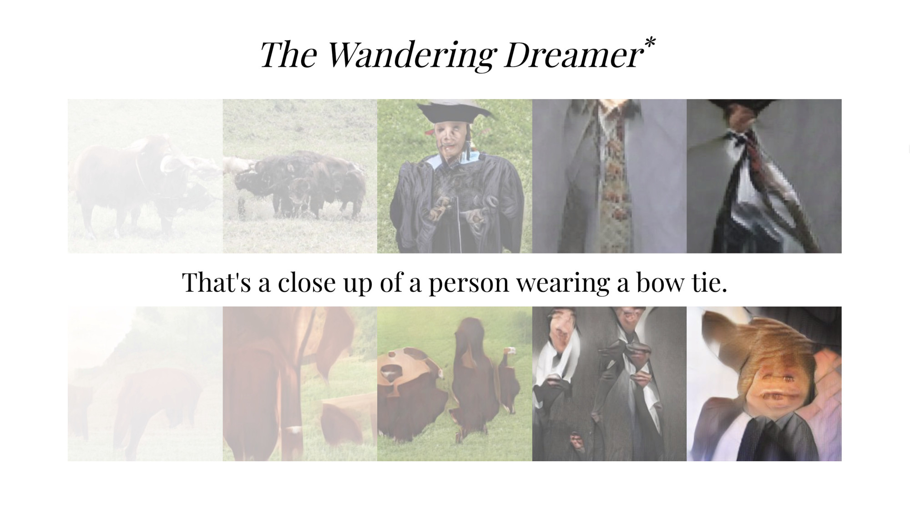

# _The Wandering Dreamer_

This experiment uses four machine learning models to create a feedback loop between synthesized images and text. All of the images you see here are fabricated, as is the text that describes each image.

1. The first row of images are produced from a class label using [BigGAN](https://arxiv.org/abs/1809.11096).
1. The text below is an autogenerated caption of the BigGAN image using [Im2Text](https://github.com/tensorflow/models/tree/master/research/im2txt).
1. The next set of images are synthesized by an [Attentional GAN](https://arxiv.org/abs/1711.10485) using the autogenerated captions.
1. The text at the bottom classifies the image above it using [MobileNet](https://arxiv.org/abs/1704.04861). This class label is then sent back to BigGAN as input to create an infinite loop.

Made by [Brannon Dorsey](https://brannon.online) using [Runway](https://runwayapp.ai).

## Running

This repository holds the front-end browser code that controls the Runway models and displays the results. You need a copy of the Runway beta app to actually run this experiment. Runway is currently in private beta, but if you have a copy of the app, you can run this project alongside it by adding the following models to your Runway workspace.

1. AttnGAN running Socket.io on port `3000`.
1. BigGAN running Socket.io on port `3001`.
1. Im2txt running Socket.io on port `3002`.
1. MobileNet running Socket.io on port `3003`.

The host and port values this front-end uses can be changed by editing [`js/main.js`](js/main.js).
